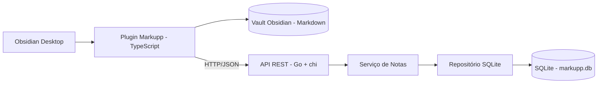
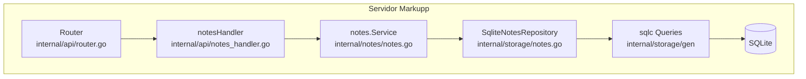

# Arquitetura C4 do Markupp

Documento único com a visão C4 do projeto Markupp, considerando o plugin Obsidian e o servidor REST em Go.

## 1. Contexto

## 2. Contêineres

## 3. Componentes do Servidor

## 4. Leitura Arquitetural

- O usuário interage com o sistema pelo Obsidian, onde o plugin Markupp executa comandos de sincronização, upload, download e importação.
- O plugin consome a API REST do servidor por HTTP/JSON, usando as rotas `/notes`.
- O servidor em Go expõe as rotas, valida as regras de negócio no serviço e persiste as notas em SQLite.
- O vault do Obsidian mantém os arquivos Markdown locais, enquanto o servidor mantém a fonte persistente das notas.

## 5. Decisões Estruturais

- Separação clara entre interface de usuário, API e persistência.
- Persistência única em SQLite, acessada via `sqlc`.
- O plugin permanece desacoplado do banco, falando apenas com a API.
